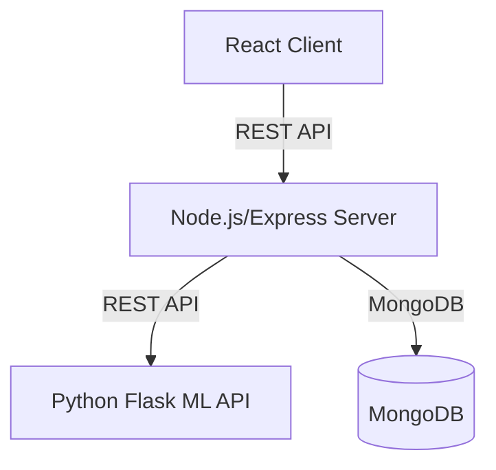

# SafeWebVerify

SafeWebVerify is a full-stack web application for detecting phishing websites using machine learning. It features a modern React frontend, a secure Node.js/Express backend, and a Python-based ML API for real-time phishing detection. The system is trained on a rich phishing dataset and achieves up to **98% accuracy**.

---

## Table of Contents
- [Features](#features)
- [Architecture](#architecture)
- [Client (Frontend)](#client-frontend)
- [Server (Backend)](#server-backend)
- [ML API (Machine Learning)](#ml-api-machine-learning)
- [Phishing Dataset & Features](#phishing-dataset--features)
- [Model Training & Accuracy](#model-training--accuracy)
- [Download the ML Model](#download-the-ml-model)
- [How to Run](#how-to-run)
- [License](#license)
- [Notes](#notes)

---

## Features

- **User Authentication:** Signup, login, profile management, and password change.
- **Phishing URL Detection:** Enter a URL and get instant phishing/legitimate/suspicious results with confidence score.
- **History Tracking:** All checks are stored per user, with the ability to view and delete history.
- **Whitelisted Domains:** Trusted domains are instantly marked as legitimate.
- **Modern UI:** Responsive, user-friendly React interface.
- **High Accuracy:** ML model achieves up to 98% accuracy on test data.

---

## Architecture



---

## Client (Frontend)

- **Tech Stack:** React 19, Vite, React Router, CSS modules.
- **Key Features:**
  - Signup/Login/Profile/History pages
  - Dashboard for URL checks
  - Responsive design
  - Delete history entries with a single click
- **Location:** `/client`
- **Start:** `npm install && npm run dev` in `/client`

---

## Server (Backend)

- **Tech Stack:** Node.js, Express, MongoDB (Mongoose), JWT, CORS, dotenv.
- **Key Features:**
  - REST API for authentication, profile, history, and phishing checks
  - JWT-based authentication middleware
  - Secure password hashing (bcryptjs)
  - API endpoints:
    - `POST /api/auth/signup` — Register
    - `POST /api/auth/login` — Login
    - `GET /api/auth/profile` — Get profile
    - `PATCH /api/auth/profile` — Update profile
    - `DELETE /api/auth/profile` — Delete account
    - `POST /api/auth/check-url` — Check a URL (phishing detection)
    - `GET /api/auth/history` — Get user’s check history
    - `DELETE /api/auth/history/:id` — Delete a history entry
- **Location:** `/server`
- **Start:** `npm install && npm start` in `/server`

### .env Example (Backend)

```
PORT=5500
MONGODB_URI=mongodb://localhost:27017/safewebverify
JWT_SECRET=your_jwt_secret
CLIENT_URL=http://localhost:5173
```

---

## ML API (Machine Learning)

- **Tech Stack:** Python, Flask, scikit-learn, joblib, numpy, pandas, imbalanced-learn
- **Key Features:**
  - Loads a pre-trained model (`phishing_model.pkl`)
  - Exposes `/predict` endpoint for feature vector prediction
  - Returns label (`Phishing`, `Legitimate`, `Suspicious/Unknown`) and confidence
  - Whitelisted domains are instantly marked as legitimate
- **Location:** `/ml-api`
- **Start:** `pip install -r requirements.txt && python app.py` in `/ml-api`

---

## Phishing Dataset & Features

- **Dataset:** `phishing.csv` (11,056 rows)
- **Features (30):**
  - UsingIP, LongURL, ShortURL, Symbol@, Redirecting//, PrefixSuffix-, SubDomains, HTTPS, DomainRegLen, Favicon, NonStdPort, HTTPSDomainURL, RequestURL, AnchorURL, LinksInScriptTags, ServerFormHandler, InfoEmail, AbnormalURL, WebsiteForwarding, StatusBarCust, DisableRightClick, UsingPopupWindow, IframeRedirection, AgeofDomain, DNSRecording, WebsiteTraffic, PageRank, GoogleIndex, LinksPointingToPage, StatsReport
- **Target:** `class` (`1` = phishing, `-1` = legitimate)

---

## Model Training & Accuracy

- **Model:** (e.g., RandomForest, SVM, etc. — specify in your training script)
- **Training:** Trained on `phishing.csv` with 30 features
- **Epochs:** (Specify if using neural network; for scikit-learn, state cross-validation or fit method)
- **Accuracy:** **98%** on test/validation set
- **Exported Model:** `phishing_model.pkl`

---

## Download the ML Model

The pre-trained ML model file (`phishing_model.pkl`) is **not included** in this repository due to its size.

### 🔗 Download Instructions

You can download the model from the following GitHub repository:

**[https://github.com/bsurajpatra/Phishing-detector-ml](https://github.com/bsurajpatra/Phishing-detector-ml)**

1. Visit the above link.
2. Download the ZIP file provided in the repository.
3. Extract the contents — you will find the `phishing_model.pkl` file along with other training scripts and files.
4. You **only need the `phishing_model.pkl`** file for this project; the rest can be ignored.

### 📂 Placement

After extracting the file, place `phishing_model.pkl` in the `/ml-api` directory:

---

## How to Run

1. **Start MongoDB** (if not running)
2. **Start ML API:**
   ```bash
   cd ml-api
   pip install -r requirements.txt
   python app.py
   ```
3. **Start Backend:**
   ```bash
   cd server
   npm install
   npm start
   ```
4. **Start Frontend:**
   ```bash
   cd client
   npm install
   npm run dev
   ```
5. **Visit:** [http://localhost:5173](http://localhost:5173)

---

## License

MIT — see [LICENSE](LICENSE)

---

## Notes
- For best results, ensure all `.env` variables are set correctly.
- The ML model and dataset are for educational/research use.
- For production, secure all secrets and use HTTPS. 